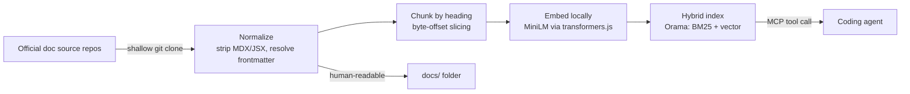

# docs-rag-mcp

A local-only RAG (Retrieval-Augmented Generation) pipeline that turns official Playwright, TypeScript, JavaScript, and Node.js runtime documentation into a searchable knowledge base, served to coding agents through the [Model Context Protocol](https://modelcontextprotocol.io) (MCP).

No cloud services, no API keys, no vector database subscription — everything runs on your machine.

## Table of Contents

- [Why this exists](#why-this-exists)
- [How it works](#how-it-works)
- [What's included](#whats-included)
- [Repository layout](#repository-layout)
- [Getting started](#getting-started)
- [Connecting an MCP client](#connecting-an-mcp-client)
- [Available MCP tools](#available-mcp-tools)
- [Keeping the docs up to date](#keeping-the-docs-up-to-date)
- [Development](#development)
- [Design notes](#design-notes)
- [Known limitations](#known-limitations)
- [Troubleshooting](#troubleshooting)
- [License](#license)

## Why this exists

Coding agents are trained on a snapshot of the internet — for a fast-moving library like Playwright, that snapshot goes stale fast. New APIs ship, old ones deprecate, and an agent's confident answer about `page.locator()` might be describing a version that's a year old.

This project fixes that by giving agents a **local, current, citable** source of truth: it pulls Playwright's, TypeScript's, JavaScript's (MDN), and Node.js's own runtime documentation straight from their source repositories, cleans and chunks it, embeds it locally, and exposes it as MCP tools an agent can query mid-conversation — the same way it would search official docs, except instant and offline.

## How it works



Four independent pipelines share the same architecture but pull from different sources:

| | Playwright docs | TypeScript docs | JavaScript docs | Node.js runtime docs |
|---|---|---|---|---|
| Source repo | [`microsoft/playwright.dev`](https://github.com/microsoft/playwright.dev) | [`microsoft/TypeScript-Website`](https://github.com/microsoft/TypeScript-Website) | [`mdn/content`](https://github.com/mdn/content) (`files/en-us/web/javascript/`) | [`nodejs/node`](https://github.com/nodejs/node) (`doc/api/`), pinned to tag `v24.18.0` |
| Sync command | `npm run sync:playwright` | `npm run sync:typescript` | `npm run sync:javascript` | `npm run sync:node` |
| Human-readable output | `docs/{nodejs,python,java,dotnet}/` | `docs/typescript/` | `docs/javascript/` | `docs/node-runtime/api/` |
| Search index | `data/index/playwright-nodejs.msp` | `data/index/typescript.msp` | `data/index/javascript.msp` | `data/index/node-runtime.msp` |
| MCP tool | `search_playwright_docs` | `search_typescript_docs` | `search_javascript_docs` | `search_node_runtime_docs` |

The Playwright and TypeScript source repos were chosen deliberately over the more "obvious" ones (`microsoft/playwright`, `microsoft/TypeScript`) — those contain compiler/library *source code*, not documentation. The actual docs live in the repos that build the public websites, which is what these pipelines clone. `mdn/content` is that same kind of repo for MDN — the Markdown source behind developer.mozilla.org — scoped to just the JavaScript language Guide and Reference (`files/en-us/web/javascript/`), not the much larger Web/DOM API surface MDN also documents.

Node.js runtime docs are the exception: `nodejs/node` is both the runtime's source *and* the documentation's source — `doc/api/*.md` is what generates nodejs.org/api. Unlike the other three pipelines, this one is pinned to a specific git tag (`v24.18.0`, an LTS release) rather than tracking a moving branch, so the corpus and the `**Added in:**`/`**Deprecated since:**` metadata parsed out of each API's `<!-- YAML -->` block stay internally consistent with one exact release. **`docs/node-runtime/`** is deliberately named to avoid clashing with **`docs/nodejs/`**, which is Playwright's *Node.js binding* docs — an unrelated corpus.

Each sync run:
1. **Clones** the doc source repo (shallow, temporary — deleted after reading).
2. **Normalizes** each page: strips Docusaurus/MDX artifacts (`<Tabs>`, `<x-search>`, decorative anchor tags) for Playwright/TypeScript, MDN's KumaScript macros (`{{jsxref(...)}}`, `{{Compat}}`, etc.) for JavaScript, or resolves Node's `<!-- YAML added:/deprecated:/changes: -->` metadata comments into readable `**Added in:**`/`**History:**` lines for the Node.js runtime docs; flattens tabbed code examples (e.g. npm/yarn/pnpm, or Python sync/async) into sequential labeled sections instead of dropping variants, and resolves frontmatter into a clean `# Title`.
3. **Writes** the cleaned Markdown to `docs/` — this is a real, browsable artifact, not just an intermediate file.
4. **Chunks** each page by heading (H2/H3 boundaries for Playwright/TypeScript/JavaScript; H2–H5 for the Node.js runtime docs, which nest as deep as module → class → event), slicing the *original* text at byte offsets rather than re-serializing — this guarantees code fences and tables survive exactly, and a `#`-looking line inside a code block is never mistaken for a heading.
5. **Embeds** every chunk locally using a small sentence-embedding model (`Xenova/all-MiniLM-L6-v2`, ~90 MB, downloaded once and cached).
6. **Indexes** everything into [Orama](https://orama.com), an embeddable engine that does full-text (BM25) and vector search in one query — "hybrid" search, so both exact API names (`page.locator`) and natural-language questions ("how do I wait for network idle") work well.
7. **Persists** the index to disk and rebuilds it from scratch every run (never mutated in place).

## What's included

**Playwright** — Node.js, Python, Java, and .NET bindings. `agent-cli` and `mcp` tooling docs are Node.js-tooling-only (they don't exist per-language upstream).

| Language | API reference | Guides | Agent CLI | MCP |
|---|---:|---:|---:|---:|
| Node.js | 73 | 74 | 22 | 31 |
| Python | 42 | 48 | — | — |
| Java | 45 | 48 | — | — |
| .NET | 44 | 46 | — | — |

**TypeScript** — the Handbook and language guides (not the compiler internals API, and not the legacy pre-3.7 handbook).

| Section | Pages | Section | Pages |
|---|---:|---|---:|
| release-notes | 48 | reference | 15 |
| handbook-v2 | 18 | declaration-files | 15 |
| tutorials | 8 | modules-reference | 7 |
| project-config | 6 | get-started | 4 |
| javascript | 4 | general | 1 |

**JavaScript** — the core language Guide and Reference from MDN (not the Web/DOM API surface).

| Section | Pages |
|---|---:|
| general | 1 |
| guide | 33 |
| reference | 1,296 |

**Node.js runtime** — the full `doc/api/` reference (fs, http, stream, buffer, child_process, worker_threads, etc.), pinned to `v24.18.0` LTS.

| | Count |
|---|---:|
| Modules (files) | 67 |
| Chunks | 4,940 |

Counts above are from the last sync in this environment and will drift as upstream docs grow — see [Keeping the docs up to date](#keeping-the-docs-up-to-date). The Node.js runtime count is the exception: since that corpus is pinned to a fixed git tag rather than a moving branch, it only changes if `NODE_TAG` in `src/node/sources.ts` is bumped to a different release.

## Repository layout

```
docs/
  nodejs/{agent-cli,api,guides,mcp}/   Human-readable Playwright Node.js docs
  python/{api,guides}/                 Human-readable Playwright Python docs
  java/{api,guides}/                   Human-readable Playwright Java docs
  dotnet/{api,guides}/                 Human-readable Playwright .NET docs
  typescript/{handbook-v2,...}/        Human-readable TypeScript docs
  javascript/{general,guide,reference}/ Human-readable JavaScript docs (MDN)
  node-runtime/api/                    Human-readable Node.js runtime docs (distinct from docs/nodejs/, Playwright's Node.js binding docs)
  ideas/                               Design rationale (idea-refine one-pagers)
src/
  types.ts                            Shared Playwright pipeline types
  ingest/                             Clone, walk, normalize, write — Playwright + shared helpers
  chunk/                              Heading-based chunker + slug resolution (Playwright)
  search/                             Embedding, Orama schema, index build/query (Playwright)
  typescript/                         Parallel, TypeScript-scoped version of ingest/chunk/search
  javascript/                         Parallel, MDN-scoped version of ingest/chunk/search
  node/                               Parallel, nodejs/node-scoped version of ingest/chunk/search
  server/index.ts                     MCP server — registers all four search tools
scripts/
  sync.ts                             Playwright sync orchestration
  sync-typescript.ts                  TypeScript sync orchestration
  sync-javascript.ts                  JavaScript (MDN) sync orchestration
  sync-node.ts                        Node.js runtime sync orchestration
tests/                                Vitest unit tests (chunkers + normalizers)
data/                                 Gitignored build output: indexes + sync metadata
```

`docs/` is committed — it's meant to be read directly, by humans or agents. `data/` is not — it's a regenerable binary artifact.

## Getting started

**Prerequisites:** Node.js ≥ 20.

```bash
git clone https://github.com/orhunakkan/docs-rag-mcp.git
cd docs-rag-mcp
npm install
```

Several dependencies (`esbuild`, `onnxruntime-node`, `protobufjs`, `sharp`) ship native binaries installed via postinstall scripts, which npm blocks by default for supply-chain safety. Approve them once:

```bash
npm approve-scripts esbuild onnxruntime-node protobufjs sharp
npm install
```

(This repo already records the approval in `package.json`'s `allowScripts` field, so a fresh clone should approve cleanly without needing to inspect the scripts yourself — but it's worth knowing *why* that field exists.)

Then build the search indexes (first run downloads the ~90 MB embedding model and caches it in `.cache/`):

```bash
npm run sync:playwright    # a few minutes
npm run sync:typescript    # faster — smaller corpus
npm run sync:javascript    # a few minutes — reference/ alone is ~1,300 pages
npm run sync:node          # a few minutes — ~5,000 chunks across 67 modules
```

Start the MCP server:

```bash
npm run mcp
```

It communicates over stdio and is meant to be launched by an MCP client, not used interactively — see the next section.

## Connecting an MCP client

Add an entry to your MCP client's config (Claude Code, Claude Desktop, Cursor, etc.), pointing at this repo with an absolute path:

```json
{
  "mcpServers": {
    "playwright-typescript-docs": {
      "command": "npx",
      "args": ["tsx", "src/server/index.ts"],
      "cwd": "/absolute/path/to/docs-rag-mcp"
    }
  }
}
```

Once connected, `search_playwright_docs`, `search_typescript_docs`, `search_javascript_docs`, and `search_node_runtime_docs` are all available as tools the agent can call.

To sanity-check the server without a full client, use the [MCP Inspector](https://github.com/modelcontextprotocol/inspector) CLI:

```bash
npx @modelcontextprotocol/inspector --cli npx tsx src/server/index.ts --method tools/list

npx @modelcontextprotocol/inspector --cli npx tsx src/server/index.ts \
  --method tools/call --tool-name search_playwright_docs \
  --tool-arg query="how do I wait for network idle" --tool-arg language=nodejs
```

## Available MCP tools

### `search_playwright_docs`

Hybrid search over Playwright's Node.js, Python, Java, and .NET documentation.

| Parameter | Type | Required | Description |
|---|---|---|---|
| `query` | string | yes | Natural-language question or exact API name |
| `limit` | integer 1–20 | no | Max results (default 5) |
| `docType` | `agent-cli` \| `api` \| `guides` \| `mcp` | no | Restrict to one doc category |
| `language` | `nodejs` \| `python` \| `java` \| `dotnet` | no | Restrict to one language — **recommended whenever the calling project's language is known**, since unfiltered queries search all four and can mix languages in the results |

### `search_typescript_docs`

Hybrid search over the TypeScript Handbook and language guides. Unrelated to Playwright.

| Parameter | Type | Required | Description |
|---|---|---|---|
| `query` | string | yes | Natural-language question or TypeScript concept |
| `limit` | integer 1–20 | no | Max results (default 5) |
| `section` | one of the 10 sections listed [above](#whats-included) | no | Restrict to one documentation section |

### `search_javascript_docs`

Hybrid search over the core JavaScript language docs from MDN — the Guide and Reference, not the broader Web/DOM API surface. Unrelated to Playwright or TypeScript.

| Parameter | Type | Required | Description |
|---|---|---|---|
| `query` | string | yes | Natural-language question or exact API name (e.g. `Array.prototype.flatMap` or "how do closures work") |
| `limit` | integer 1–20 | no | Max results (default 5) |
| `section` | `general` \| `guide` \| `reference` | no | Restrict to one documentation section |

### `search_node_runtime_docs`

Hybrid search over the official Node.js runtime API reference (nodejs.org/api), pinned to `v24.18.0` LTS. Unrelated to Playwright, TypeScript, or JavaScript-the-language. Every result includes any `**Added in:**`/`**Deprecated since:**`/`**History:**` metadata Node's own docs record for that API.

| Parameter | Type | Required | Description |
|---|---|---|---|
| `query` | string | yes | Natural-language question or exact API name (e.g. `fs.readFile` or "how do I pipe a readable stream") |
| `limit` | integer 1–20 | no | Max results (default 5) |
| `module` | string | no | Restrict to one module by its `doc/api` file stem (e.g. `fs`, `http`, `child_process`, `stream`) — not a fixed enum, since the ~67-module set isn't hardcoded into the tool schema; an unrecognized value just yields zero results rather than erroring |

All four tools return cited excerpts — every result includes a working source URL back to the live docs site.

## Keeping the docs up to date

Sync is **manual and on-demand**, not automatic — there's no cron job, webhook, or file watcher. Re-run the relevant sync command whenever you want fresher docs:

```bash
npm run sync:playwright
npm run sync:typescript
npm run sync:javascript
npm run sync:node
```

A few things worth knowing:
- **Restart the MCP server after resyncing.** It loads its index into memory once, on the first tool call, and caches it for the life of the process — a resync in another terminal won't be picked up until the server restarts.
- **Sync adds and overwrites; it never deletes.** If an upstream page is renamed or removed, the old local file is left behind (stale, but no longer part of the search index, since a resync always rebuilds the index from scratch based on what's currently upstream). Clean these up by hand when you notice them — `git status` after a sync will show any new file alongside an unrelated leftover.
- Each sync's exact source commit is recorded in `data/sync-meta.json` / `data/sync-meta-typescript.json` / `data/sync-meta-javascript.json` / `data/sync-meta-node.json`, so you always know precisely which upstream revision the current index reflects.
- **`npm run sync:node` re-running does not move to a newer Node.js release on its own.** Unlike the other three pipelines, it's pinned to a fixed git tag (`NODE_TAG` in `src/node/sources.ts`, currently `v24.18.0`) rather than a moving branch, since the whole point is a version-consistent corpus with accurate `**Added in:**`/`**Deprecated since:**` metadata. To move to a different release (a newer LTS, for example), update `NODE_TAG` and re-run the sync.

## Development

| Command | Purpose |
|---|---|
| `npm run typecheck` | `tsc --noEmit` — no build step, `tsx` runs TypeScript directly |
| `npm test` | Runs the Vitest unit suite (normalizers + all four chunkers) |
| `npm run sync:playwright` / `sync:typescript` / `sync:javascript` / `sync:node` | Full ingest → chunk → embed → index pipeline |
| `npm run mcp` | Start the MCP server |

Before changing `src/ingest/normalize.ts`, `src/chunk/chunker.ts`, or their TypeScript/JavaScript/Node-side counterparts in `src/typescript/`, `src/javascript/`, and `src/node/`, run the test suite — all four chunkers are covered for the tricky cases that actually broke in development: code fences containing `#`-prefixed lines being mistaken for headings, duplicate heading text needing distinct anchors, (Playwright-specific) chunk IDs colliding across languages, (JavaScript-specific) MDN sections left empty once macro widgets like `{{Compat}}` are stripped, and (Node-specific) headings nesting past H3 plus malformed-looking `<!-- YAML -->` blocks (e.g. an indented closing `-->`) that need tolerant parsing rather than crashing the sync.

## Design notes

- **Fully local.** Embeddings run on-device via [transformers.js](https://github.com/huggingface/transformers.js); the search index is a single file on disk. No API keys, no network calls at query time.
- **Hybrid search tuning matters more than it looks.** Orama's default vector-similarity cutoff (0.8) is tuned for larger embedding models and silently drops nearly every result for this MiniLM model's short-text embeddings — degenerating "hybrid" search into plain keyword search. `src/search/query.ts` lowers this to `0.1` and rebalances the blend toward vector (`0.7`) after empirically checking real queries against the corpus. If you swap the embedding model, re-validate this.
- **Chunk IDs are namespaced** by language/section specifically to avoid collisions — e.g. Node's and Python's `class-page.mdx` `locator()` method would otherwise produce the identical id `api/class-page#page-locator`.
- **Explicit anchor slugs aren't always unique upstream.** One real example: .NET's `class-browsercontext.mdx` gives two *different* methods (`RunAndWaitForConsoleMessageAsync` and `WaitForConsoleMessageAsync`) the same literal anchor. The chunker runs every slug (explicit or auto-derived) through the same dedup logic to handle this.
- **MDN pages are one-directory-per-page (`some/topic/index.md`), not flat files.** `src/javascript/walk.ts` walks directories rather than filenames, unlike the Playwright/TypeScript walkers — and `slug` comes from frontmatter rather than being derived from the path, since MDN's frontmatter `slug:` maps directly onto the live URL (`https://developer.mozilla.org/en-US/docs/<slug>`), the same pattern TypeScript's `permalink` frontmatter field already established.
- **MDN's KumaScript macros (`{{jsxref(...)}}`, `{{Compat}}`, `{{optional_inline}}`, ...) replace Docusaurus/MDX as the thing `src/javascript/normalize.ts` strips.** Xref-style macros resolve to inline code (they almost always name an API identifier); inline status badges resolve to plain text; everything else — compat tables, live-sample embeds, deprecation banners — is dropped, since those render as interactive widgets with no plain-text equivalent worth modeling. A section left with nothing but a stripped macro (MDN's boilerplate "Specifications"/"Browser compatibility" headings) is dropped by the chunker rather than indexed as an empty result.
- **Node's `<!-- YAML ... -->` doc-metadata comments are genuine (if slightly irregular) YAML**, not another macro dialect — `src/node/normalize.ts` parses them with the `yaml` package rather than hand-rolled regex, since fields like `changes` nest a list of `{version, pr-url, description}` objects and `version`/`added`/`deprecated` can each be a single string or an array (dual-backported fixes). Parsed fields are rendered as `**Added in:**`/`**Deprecated since:**`/`**History:**` lines; `pr-url` is dropped as noise not worth indexing. A handful of blocks across the corpus have a closing `-->` indented onto its own line rather than immediately after the content — the block regex tolerates that, and a block that still fails to parse is logged and dropped rather than aborting the sync.
- **doc/api/*.md nests deeper than the other three corpora** — module (H1) → section (H2) → class (H3/H4) → event/method (H4/H5) — so `src/node/chunker.ts` tracks headingPath through H5, not just H2/H3 like the Playwright/TypeScript/JavaScript chunkers.
- **The Node.js runtime corpus is pinned to a git tag, not a branch.** `cloneDocsRepo()` in `src/ingest/clone.ts` gained an optional `ref` parameter for this (`git clone --branch <ref>`); the other three pipelines still call it without one and track their default branch.
- Full design rationale, including rejected alternatives and open assumptions, lives in [`docs/ideas/playwright-rag-docs-mvp.md`](docs/ideas/playwright-rag-docs-mvp.md).

## Known limitations

- Unfiltered queries search across all languages/sections at once and can return a mix — pass `language`/`section` when you know it.
- Retrieval quality hasn't been rigorously benchmarked, just spot-checked against a handful of representative queries per corpus.
- No automated freshness checks — a stale index is silent until you notice search results don't mention a feature you know exists.
- The JavaScript corpus's Reference section is large (~1,300 pages, one per global object/method/operator/error), so unfiltered queries there are more likely to return a long tail of loosely-related methods than Playwright's or TypeScript's smaller corpora.
- Content behind MDN's stripped macros (browser-compat tables, live interactive examples) isn't retrievable at all — only the surrounding prose is indexed.
- The Node.js runtime corpus is frozen to `v24.18.0` LTS until `NODE_TAG` is bumped by hand — it will not reflect anything shipped after that release.
- `search_node_runtime_docs`'s `module` filter isn't a fixed enum (unlike `language`/`docType`/`section` on the other tools) since hardcoding all ~67 module names into the tool schema seemed unnecessary — an agent guessing a module name that doesn't exist just gets zero results, not an error.
- Anchor slugs for the Node.js runtime docs are auto-generated with `github-slugger` and spot-checked against nodejs.org's own anchors, but aren't guaranteed to match exactly in every case — Node's own doc generator has its own slugging quirks (see the Playwright .NET dedup example above for the general shape of this class of issue).

## Troubleshooting

**`npm install` warns about blocked install scripts.** Expected on a first clone — see [Getting started](#getting-started).

**A tool call returns "No matching documentation found."** The index likely hasn't been built yet, or the server started before a resync finished. Run the relevant `npm run sync:*` command, then restart `npm run mcp`.

**`ENOENT` on `data/index/*.msp` when starting the server.** Same cause — the server expects a pre-built index; it doesn't build one on startup.

## License

ISC — see `package.json`.
